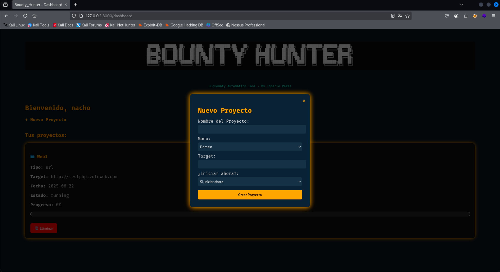
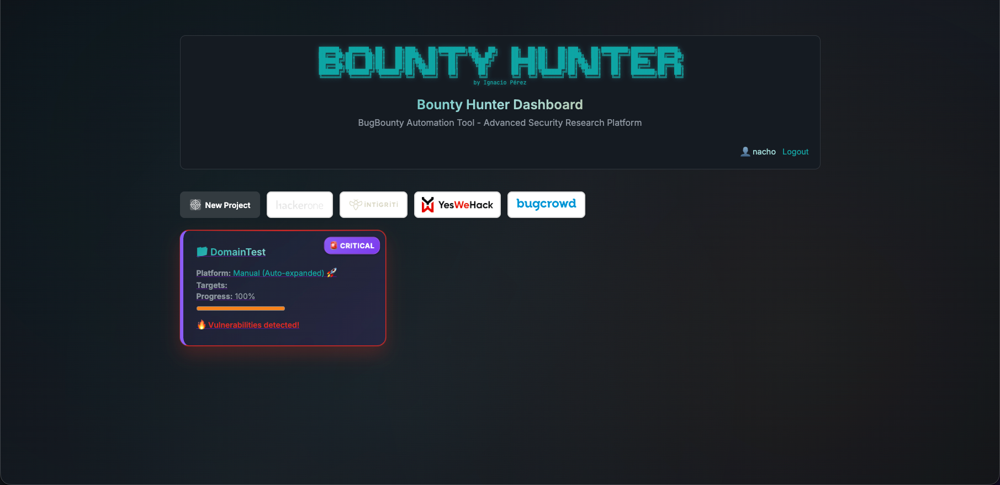

# Bounty_Hunter Web Edition


> Plataforma web avanzada para automatizar el flujo completo de Bug Bounty y pentesting, con control granular, integración de herramientas, y generación de reportes profesionales.

## ✨ Capturas de Pantalla

<p align="center">
  
  <br><em>Dashboard de proyectos</em>
</p>

<p align="center">
  
  <br><em>Detalle de resultados por etapa</em>
</p>

<p align="center">
  
  <br><em>Exportación PDF con colores y conteo</em>
</p>

---
## 🆕 Novedades de la versión actual

- **Arquitectura modular**: Separación clara entre backend, módulos de escaneo, utilidades y controladores.
- **Sistema de módulos plug-and-play**: Agrega o elimina scripts de escaneo fácilmente en [`modules/`](modules/).
- **Controladores centralizados**: Lógica desacoplada en [`backend/controllers/`](backend/controllers/).
- **Gestión de proyectos**: Creación, seguimiento y control de proyectos desde la web.
- **Ejecución y orquestación de etapas**: Control total sobre cada etapa (iniciar, detener, saltar, repetir).
- **Integración de herramientas externas**: Subfinder, Assetfinder, httpx, gau, katana, nuclei, dalfox, sqlmap, XSStrike, ffuf, arjun, entre otras.
- **Persistencia con SQLite**: Base de datos gestionada desde [`backend/init_db.py`](backend/init_db.py) y [`backend/models.py`](backend/models.py).
- **Exportación avanzada**: Generación de reportes PDF con [`export/burp_export.py`](export/burp_export.py) y soporte visual de colores ANSI.
- **Configuración flexible**: Archivos JSON para herramientas y módulos en [`config/`](config/).
- **CLI y automatización**: Scripts CLI en [`cli/`](cli/) y binarios en [`bin/`](bin/).
- **Soporte Docker**: Despliegue rápido con [`Dockerfile`](Dockerfile) y [`docker-compose.yml`](docker-compose.yml).
- **Frontend moderno**: Plantillas Jinja2 en [`templates/`](templates/) y recursos estáticos en [`static/`](static/).
- **Utilidades reutilizables**: Funciones auxiliares en [`backend/utils.py`](backend/utils.py).
- **Resultados organizados**: Salida de cada etapa en [`results/`](results/), con conteo automático y visualización web.

---

## 📂 Estructura del Proyecto

```
bounty_hunter.py           # Script principal/launcher
db.sqlite3                 # Base de datos SQLite
Dockerfile                 # Imagen Docker optimizada
docker-compose.yml         # Orquestación multi-servicio
requirements.txt           # Dependencias Python
backend/
    main.py                # FastAPI app principal
    auth.py                # Autenticación y seguridad
    constants.py           # Constantes globales
    init_db.py             # Inicialización de la base de datos
    models.py              # Modelos ORM SQLAlchemy
    modules_list.py        # Registro dinámico de módulos
    project_routes.py      # Rutas API para proyectos
    scan_worker.py         # Orquestador de escaneos
    utils.py               # Utilidades generales
    controllers/           # Lógica desacoplada por dominio
bin/
    tplmap                 # Herramienta auxiliar
cli/
    etapas/                # Scripts CLI para etapas
config/
    installed.json         # Herramientas instaladas
    tools.json             # Configuración de herramientas
export/
    burp_export.py         # Exportador de resultados a PDF/Burp
modules/
    arjun.py               # Módulo Arjun (param discovery)
    dalfox_scan.py         # Módulo Dalfox (XSS)
    ffuf.py                # Módulo FFUF (fuzzing)
    gf_qsreplace.py        # Módulo GF + QSReplace
    lfi.py                 # Módulo LFI
    nuclei_scan.py         # Módulo Nuclei
    ...                    # Otros módulos plug-and-play
results/                   # Resultados de escaneos
static/                    # Archivos estáticos frontend
templates/                 # Plantillas Jinja2
tools/                     # Herramientas externas
utils/                     # Utilidades compartidas
```

---

## 🚀 Instalación y Puesta en Marcha

```bash
# Clonar el repositorio
git clone https://github.com/pereznacho/Bounty_Hunter2.git
cd Bounty_Hunter2

# Crear entorno virtual
python3 -m venv env
source env/bin/activate

# Instalar dependencias Python
pip install -r requirements.txt

# Instalar herramientas externas necesarias
chmod +x setup_tools.sh
./setup_tools.sh

# Iniciar servidor local
uvicorn backend.main:app --reload

# O usando Docker
docker build -t bounty_hunter .
docker run -p 8000:8000 bounty_hunter
```

---

## 🖥️ Uso y Flujo de Trabajo

1. **Crear proyecto**: Desde la interfaz web, define el nombre y tipo (dominio/URL).
2. **Orquestar etapas**: Controla cada etapa (subdominios, hosts, URLs, vulnerabilidades) desde el dashboard.
3. **Visualizar resultados**: Accede a los archivos generados en tiempo real, con colores y conteo automático.
4. **Exportar reporte**: Descarga el informe PDF final desde la web.
5. **Personalizar módulos**: Agrega scripts en [`modules/`](modules/) y regístralos en [`backend/modules_list.py`](backend/modules_list.py).
6. **Configurar herramientas**: Edita [`config/tools.json`](config/tools.json) para rutas y parámetros.

---

## 🛠️ Módulos y Funcionalidades

- **Enumeración de subdominios**: Subfinder, Assetfinder
- **Detección de hosts vivos**: httpx
- **Extracción de URLs**: gau, waybackurls, katana
- **Descubrimiento de parámetros**: Arjun
- **Fuzzing y escaneo de vulnerabilidades**: FFUF, Dalfox, Nuclei, XSStrike, sqlmap, LFI, GF+QSReplace
- **Exportación avanzada**: PDF, Burp Suite, Markdown
- **Gestión de proyectos**: CRUD, seguimiento, logs, control de etapas
- **Autenticación**: (en desarrollo, ver roadmap)
- **Integración CLI**: Scripts y binarios auxiliares

---

## ⚙️ Configuración

- **Herramientas externas**: Configura rutas y parámetros en [`config/tools.json`](config/tools.json).
- **Módulos**: Agrega nuevos módulos Python en [`modules/`](modules/) y actualiza [`backend/modules_list.py`](backend/modules_list.py).
- **Base de datos**: SQLite gestionada automáticamente; puedes migrar a otro motor editando [`backend/init_db.py`](backend/init_db.py).

---

## 📈 Roadmap

- [x] Arquitectura modular y plug-and-play
- [x] Exportación PDF avanzada
- [x] Orquestación granular de etapas
- [ ] Autenticación y gestión de usuarios ([`backend/auth.py`](backend/auth.py))
- [ ] WebSocket para actualización en tiempo real
- [ ] Importación/exportación de proyectos completos
- [ ] Estadísticas globales y métricas
- [ ] Integración con Discord/Slack

---

## ✨ Capturas de Pantalla

- Dashboard de proyectos
- Detalle de resultados por etapa
- Exportación PDF con colores y conteo

---

## 🧑‍💻 Autor

Desarrollado por **Ignacio Pérez** ([@iperez](https://github.com/pereznacho))

> "Automatizá tu recon. Repetí tus escaneos. Dominá tu proceso."

---

⚠ Uso exclusivo con fines educativos y de investigación. No utilizar sin autorización expresa de los propietarios de los
