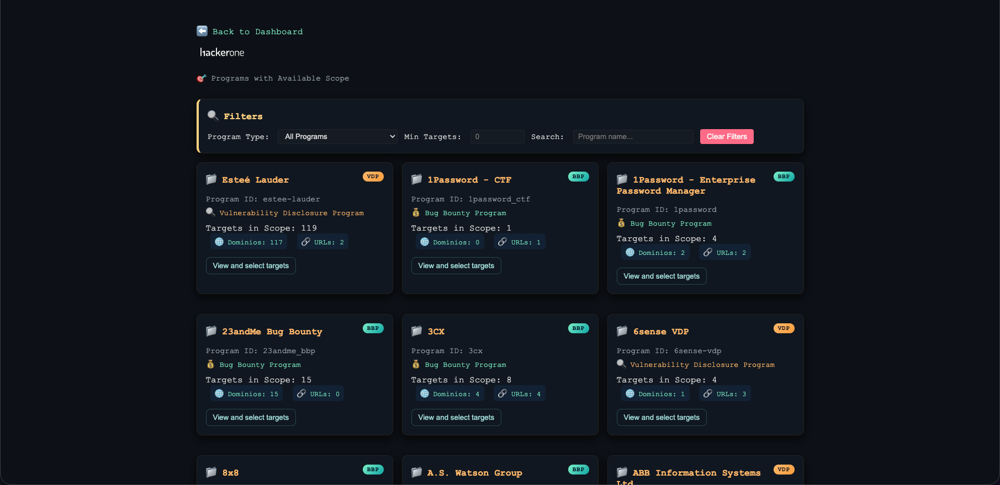
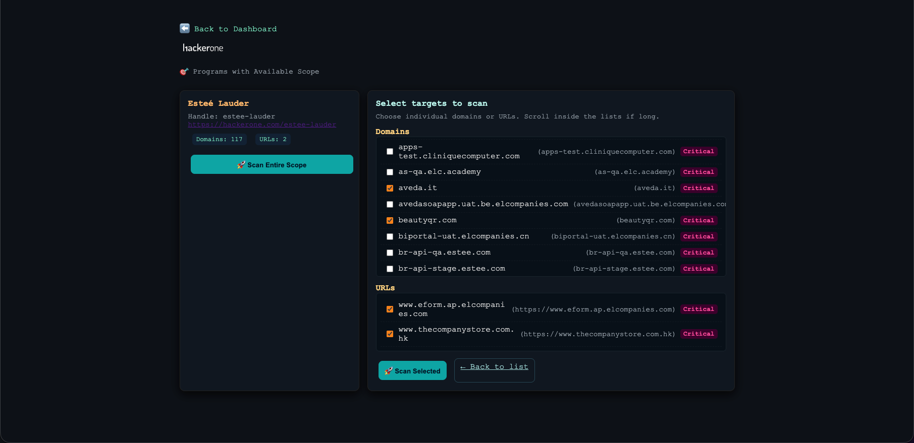
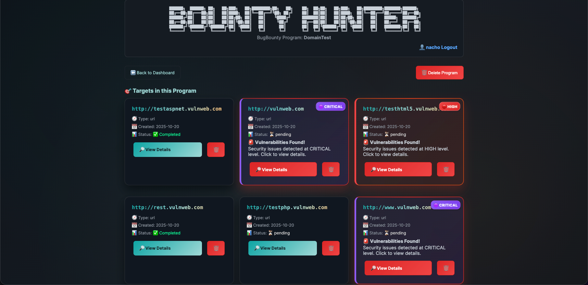
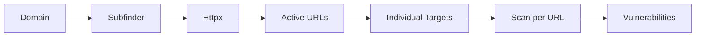
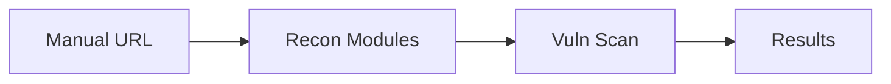

# 🎯 Bounty_Hunter

**Advanced Bug Bounty Automation Tool** - Complete bug bounty automation platform with multi-platform integration, real-time vulnerability detection and auto-expanded mode.

> *by Ignacio Pérez*

---

## � Screenshots

### Login Page


### Dashboard Overview


### Manual Form Creation


### BugBounty Programs View


### BugBounty Program Choose Targets


### Dashboard Overview and Alerts


---

## �🚀 Key Features

### 🔄 **Auto-Expanded Mode** ⭐ NEW
- **Automatic domain expansion**: Domains automatically expand to all their active URLs
- **Uniform behavior**: Bounty programs work exactly like manual form
- **Smart discovery**: Subfinder + Httpx to find all scannable URLs
- **Individual targets**: Each discovered URL is scanned as independent web application

### 🌐 **Advanced Multi-platform Integration**
- **HackerOne**: Automatic program import and complete scope
- **Intigriti**: Native integration with auto-expanded enabled
- **YesWeHack**: Full support for European programs
- **Bugcrowd**: Crowdsourced security platform integration

### 🔍 **Automated Reconnaissance Suite**
- **Subfinder**: Subdomain discovery with 40+ sources
- **Assetfinder**: Backup enumeration and asset discovery
- **Httpx**: Active URL verification with technology detection
- **GAU**: Historical URL extraction (GetAllUrls)
- **Waybackurls**: URLs from Wayback Machine
- **Katana**: Web crawler with JavaScript support

### 🛡️ **Vulnerability Analysis Engine**
- **Nuclei**: 5000+ updated vulnerability templates
- **Dalfox**: Specialized XSS scanner with bypass techniques
- **XSStrike**: XSS vulnerability detection scanner
- **SQLMap**: Automatic SQL injection detection and exploitation

### 🎨 **Modern Dashboard with Real-time Alerts**
- **Live updates**: Vulnerability status every 10 seconds
- **Alert system**: Instant notifications for critical findings
- **Responsive design**: Optimized for desktop and mobile

---

## 📊 Vulnerability Criticality System

### 🔥 **Criticality Levels by Tool**

| Tool | Critical | High | Medium | Low |
|------------|----------|------|--------|-----|
| **Nuclei** | RCE, SQLi Auth Bypass | XSS Stored, SSRF | XSS Reflected, Info Disclosure | Fingerprinting, Misconfig |
| **Dalfox** | Stored XSS | Reflected XSS (High Impact) | Reflected XSS (Medium Impact) | DOM XSS, Low Impact |
| **SQLMap** | Boolean/Time-based SQLi | Error-based SQLi | Union-based SQLi | Information Schema Access |

### 🎨 **Dashboard Color Coding**
- 🟣 **CRITICAL**: Purple - Immediate exploitation, full access
- 🔴 **HIGH**: Red - High impact vulnerabilities
- 🟠 **MEDIUM**: Orange - Moderate risk, requires combination
- 🟢 **LOW**: Green - Information, minor configuration

---

## 📦 Installation and Configuration

### 🔧 **Prerequisites**
- **Docker** 20.10+ and **Docker Compose** v2
- **Git** for repository cloning
- **4GB RAM** minimum (8GB recommended)
- **20GB** free space for results

### ⚡ **Quick Installation**

```bash
# Clone repository
git clone https://github.com/your-user/Bounty_Hunter.git
cd Bounty_Hunter

# Build and run
docker-compose up --build

# Access application
# http://localhost:8000

# Or Download from DockerHub
docker pull nachin519/bounty_hunter

```

### 🔐 **Initial Setup**
1. **Create user**: Register at `/register`
2. **Login**: Access with credentials
3. **Create project**: Manual or import from bounty programs

---

## 🎯 Workflows

### 🔄 **Auto-Expanded Workflow** (Recommended)



1. **Input**: `example.com` from any bounty program
2. **Subfinder**: Finds `app.example.com`, `api.example.com`, etc.
3. **Httpx**: Verifies `https://app.example.com`, `https://api.example.com`
4. **Target Creation**: Each URL as individual target
5. **Scanning**: Nuclei + Dalfox + SQLMap on each URL
6. **Results**: Vulnerabilities organized by target

### 📝 **Manual Workflow**



1. **Create manual project**
2. **Add specific targets** 
3. **Run complete scan**
4. **Review vulnerabilities**

---
## Workflow and Tools
1. recon.py — Enumeration and URL/target collection
    • Tools/techniques: subfinder, assetfinder, httpx (checks alive), katana / waybackurls / gau (historical endpoint collection), pipelines to combine results.
    • Stage: Recon / asset discovery (domains → URLs).
2. prepare_url_scan.py — List preparation and sanitization
    • Tools/techniques: internal scripts to deduplicate, normalize schemes (http/https), filter and generate working lists (urls.txt, etc.).
    • Stage: Pre-processing before scanning/fuzzing.
3. arjun.py — Discover hidden parameters
    • Tools/techniques: Arjun (GET/POST parameter enumeration and endpoints accepting parameters).
    • Stage: Parameter recon / surface discovery.
4. gf_qsreplace.py — Pattern filtering + parameter replacement
    • Tools/techniques: gf (pattern/payload filtering) and qsreplace (substitute parameters with payloads for fuzzing).
    • Stage: Payload preparation / URL selection for fuzz/XSS/LFI.
5. ffuf.py — Path and directory fuzzing
    • Tools/techniques: FFUF (directory/endpoint fuzzing) with wordlists (common.txt, api.txt, etc.).
    • Stage: Fuzzing / dynamic path enumeration.
6. dalfox_scan.py — XSS detection and exploitation
    • Tools/techniques: Dalfox (automated XSS scanning, payloads and reflected/stored testing).
    • Stage: XSS detection / vector exploitation.
7. tplmap.py — Template Injection / SSTI
    • Tools/techniques: tplmap (server-side template injection detection/exploitation in engines like Jinja2, Twig, Mako, etc.).
    • Stage: SSTI detection/exploitation / template injection.
8. lfi.py — Local File Inclusion checks
    • Tools/techniques: payload lists + response checks; custom scripts to detect LFI/path traversal.
    • Stage: LFI detection / path traversal.
9. nuclei_scan.py — Template-based scanning (CVE / misconfigs / exposures)
    • Tools/techniques: Nuclei with YAML templates (misconfigurations, CVEs, takeover, exposures, etc.).
    • Stage: Massive scanning of known signatures/vulnerabilities.
10. sqli.py — SQL injection detection
    • Tools/techniques: sqlmap (automates SQLi tests, DBMS extraction, users, DBs and evidence).
    • Stage: SQLi detection / exploitation.

## 🌟 New Features Added

### ✨ **Auto-Expanded Mode**
- **Problem solved**: Bounty programs now create individual URL targets
- **Uniform behavior**: Manual form = Bounty programs
- **Implementation**: Interception in `scan_worker.py` with automatic detection

### 🎨 **Enhanced Dashboard**
- **Unfiltered logos**: HackerOne, Intigriti, YesWeHack, Bugcrowd with original colors
- **Real-time alerts**: Vulnerability detection every 10 seconds
- **Push notifications**: Browser alerts for new findings

### 🛠 **Optimized Backend**
- **Unified routers**: Clean and maintainable code
- **Error handling**: Robust error and timeout management
- **Performance**: Parallel scanning and database optimizations

---

## 🔧 Advanced Configuration

### 🎛️ **Environment Variables**
```bash
# Database
DATABASE_URL=sqlite:///./bounty_hunter.db

# Scanning
MAX_CONCURRENT_SCANS=3
SCAN_TIMEOUT=3600

# Notifications  
ENABLE_NOTIFICATIONS=true
CHECK_INTERVAL=10
```

### 📁 **Directory Structure**
```
Bounty_Hunter/
├── backend/           # FastAPI application
├── templates/         # HTML templates  
├── static/           # CSS, JS, images
├── results/          # Scan results
├── modules/          # Recon modules
└── docker-compose.yml
```

---

## 🤝 Contributing

### 🐛 **Report Bugs**
- Use GitHub Issues with template
- Include error logs and reproduction steps

### 💡 **New Features** 
- Fork the repository
- Create branch feature/new-feature
- Pull request with detailed description

### 📧 **Contact**
- **Site**: https://iperez.com.ar
- **Email**: nacho@iperez.com.ar
- **Twitter**: @nachoct
- **LinkedIn**: /in/ignacio-perez

---

## 📄 License

MIT License - See [LICENSE](LICENSE) for more details.

---

## ⚡ Recent Changelog

### v2.1.0 (Latest)
- ✅ **Auto-Expanded Mode**: Bounty programs now work like manual
- ✅ **Enhanced dashboard**: Unfiltered logos, real-time alerts  
- ✅ **Optimized backend**: Clean routers, better error handling
- ✅ **Criticality system**: Updated colors according to cybersecurity standards

### v2.0.0
- ✅ **Multi-platform support**: HackerOne, Intigriti, YesWeHack, Bugcrowd
- ✅ **Real-time monitoring**: Vulnerability detection automation
- ✅ **Modern UI**: Dark theme, responsive design

---

**🎯 Bounty_Hunter - Automating security, one scan at a time.**
