# Bounty_Hunter

**Bug Bounty Automation Platform** — End-to-end tool that manages vulnerability-hunting projects, integrates programs from platforms (HackerOne, Intigriti, YesWeHack, BugCrowd), runs reconnaissance and vulnerability scans, and centralizes results in a dashboard with real-time alerts.

> *by Ignacio Pérez*

---

## Table of Contents

- [What is Bounty_Hunter?](#what-is-bounty_hunter)
- [Screenshots](#screenshots)
- [What does it do?](#what-does-it-do)
- [How does it work?](#how-does-it-work)
- [Flow diagrams](#flow-diagrams)
- [Installation and configuration](#installation-and-configuration)
- [Project structure](#project-structure)
- [Scan modules](#scan-modules)
- [Routes and API](#routes-and-api)
- [Themes and export](#themes-and-export)
- [Contributing and contact](#contributing-and-contact)
- [Changelog and license](#changelog-and-license)

---

## What is Bounty_Hunter?

**Bounty_Hunter** is a web application that automates and orchestrates typical bug bounty workflow:

1. **Project management**: Create projects manually (a domain or a URL) or import full scope from HackerOne, Intigriti, YesWeHack, or BugCrowd.
2. **Reconnaissance**: From domains, it discovers subdomains (Subfinder), checks which are live (Httpx), and gathers historical URLs (GAU, Waybackurls, Katana).
3. **Target selection**: For domain-based projects, discovered URLs are stored and you choose in the UI which ones to scan. Each selected URL becomes an independent *target*.
4. **Scan pipeline**: For each target (domain or URL), a fixed chain of modules runs: Recon, Directory discovery, Arjun, Nuclei, WAF, LFI, XSS (XSStrike), SQLi (SQLMap), FFUF, WFUZZ, Dalfox, Tplmap, GF+qsreplace, etc. Results are saved in per-target directories and indexed for the dashboard.
5. **Results and alerts**: The dashboard shows the status of each project and target, detects vulnerabilities from module output files, and displays severity levels (critical, high, medium, low) with real-time alerts (e.g. polling every 10 seconds) and export to PDF, Markdown, or Burp format.

The application is built with **FastAPI** (backend), **Jinja2** (HTML templates), **SQLAlchemy** (SQLite by default), and a **worker** layer in threads that run the modules (Python scripts and Go/other binaries) in the order defined in `backend/constants.MODULES`.

---

## Screenshots

| Screenshot | Description |
|------------|-------------|
| 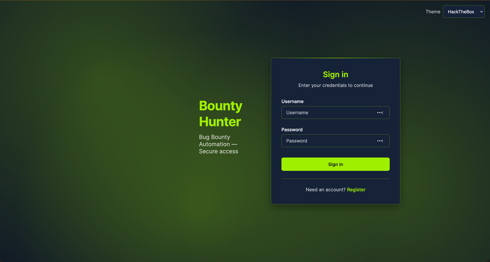 | Overview |
| 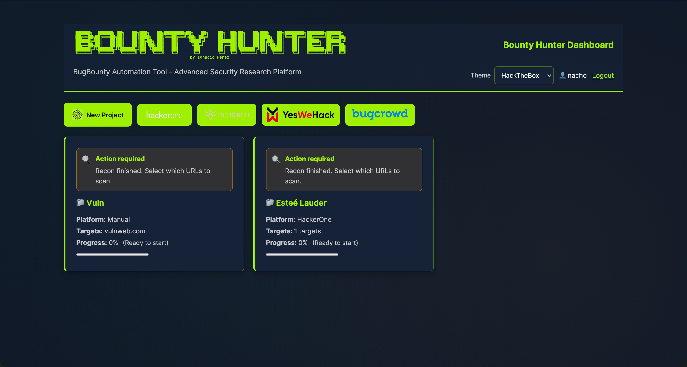 | Dashboard and projects |
| 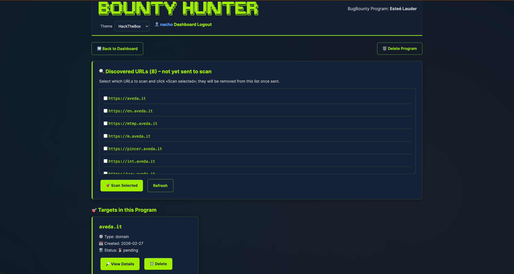 | Target and URLs view |
| 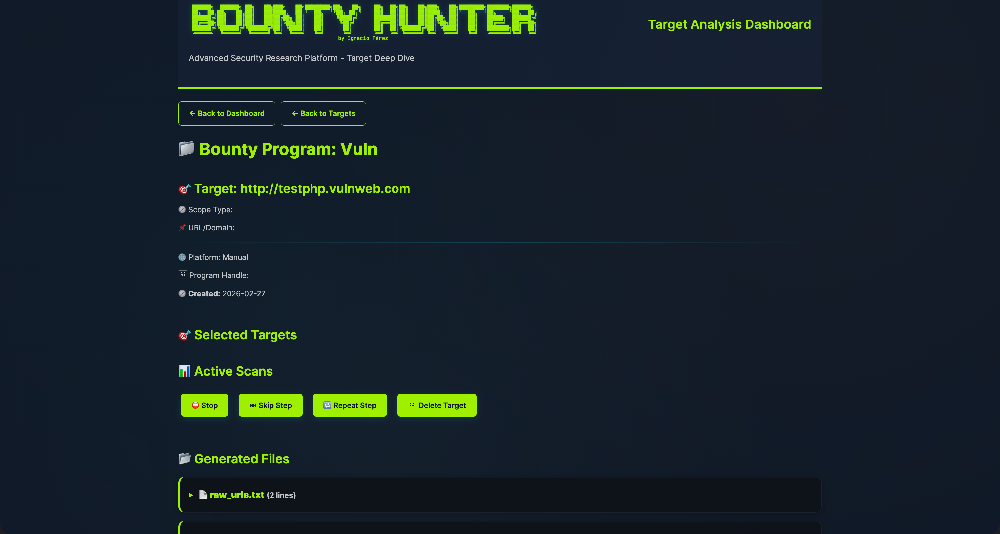 | Target analysis |
| 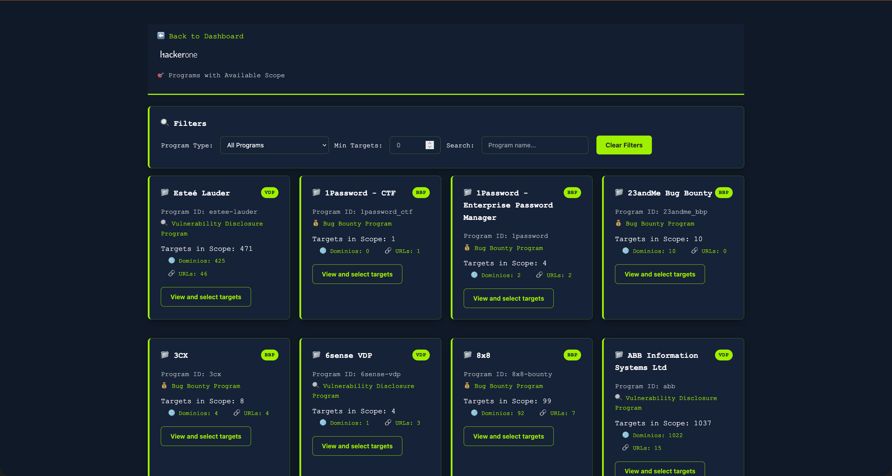 | Platform programs (e.g. HackerOne) |

---

## What does it do?

- **Authentication**: User registration and login; session stored in a cookie. Optional JSON API (`/auth/register`, `/auth/login`).
- **Dashboard**: List of the user’s projects with platform (Manual, HackerOne, Intigriti, YesWeHack, BugCrowd), target summary, scan progress, and vulnerability status (with severity colors). Indicates when a project is *awaiting URL selection* (recon done, URLs left to choose).
- **Manual projects**: Form for name, target (domain or URL), and “start now”. If it’s a domain and start now is chosen, recon runs and discovered URLs are saved for selection; if it’s a URL, the full scan can be started directly.
- **Platform projects**: From each router (HackerOne, Intigriti, YesWeHack, BugCrowd) you list programs, pick targets from scope, and create a project with one or more targets (domain or URL). If only domains, recon runs and URLs are saved for selection; if URLs, the scan runs on those targets.
- **Targets view**: For each project you see the list of targets (and, when applicable, the list of discovered URLs pending selection). From there you can select URLs to scan, start/stop/skip module per target, delete a target, or open target detail.
- **Target detail**: Progress per module, result files, scan log, and vulnerability detection with severity and option to mark alert as viewed.
- **Scanning**: For each target a directory `results/<target_safe>_<timestamp>` is created and modules in `MODULES` run in order. The Recon module, in domain mode, can create extra targets from `live_subdomains.txt` (auto-expansion) and launch scans for each new URL in the background.
- **Alerts**: Periodic check (e.g. every 10s) for new findings; browser notifications and dashboard badges.
- **Export**: Reports as PDF (WeasyPrint), Markdown report download, and Burp export (text file with URLs/parameters).

---

## How does it work?

- **Backend**: FastAPI in `backend/main.py` mounts auth (`backend/auth.py`), project (`backend/project_routes.py`, `backend/routers/project.py`), HackerOne, Intigriti, YesWeHack, and BugCrowd routers. Database is SQLite (configurable via `SQLALCHEMY_DATABASE_URL`); models in `backend/models.py` (User, Project, Target, ScanState, DiscoveredURL, etc.).
- **Auth**: SessionMiddleware with cookie; `get_current_user` depends on `user_id` in session. UI themes are stored per user; a theme cookie is used for public pages (login/register).
- **Project creation**:  
  - Manual: `POST /project/new` creates Project, one Target (domain or url), ScanState and, if “start now” and domain, runs in a thread `run_domain_recon_save_for_selection` (recon + save to `DiscoveredURL` and status `awaiting_url_selection`).  
  - Platforms: Each router receives the form with handle/name and target list; creates Project (with `platform` and `created_from_*` flags), multiple Targets, and ScanState; if domains, calls `run_domain_recon_save_for_selection`; if only URLs, calls `run_scan(project_id)`.
- **Recon for selection**: `run_domain_recon_save_for_selection` (in `modules/recon.py`) for each domain runs Subfinder, merges domains, runs Httpx, collects active URLs, clears `DiscoveredURL` for the project, inserts the new URLs, and sets ScanState to `awaiting_url_selection`.
- **URL selection and scan start**: The user selects URLs in the targets view. `POST /project/{id}/discovered-urls/scan` creates a Target per selected URL, removes those URLs from `DiscoveredURL`, sets ScanState to running, and calls `launch_scans_for_new_targets(project_id)`, which for each pending URL target starts in a thread `run_scan_target(project_id, target_url)`.
- **Scan pipeline**: `run_scan` gets all targets of the project and for each calls `run_scan_target`. `run_scan_target` creates the results directory, marks the target as running, iterates `MODULES` and for each index calls `execute_single_module`. Each module runs in an isolated subprocess (`run_module_isolated`) with a generated driver that invokes the right runner (recon, nuclei, dalfox, sqlmap, etc.). After Recon in domain mode, `create_targets_from_recon` is called (reads `live_subdomains.txt` and creates new Targets), then `launch_scans_for_new_targets` for those new targets. When all modules for the target finish, it is marked completed and `reporte.md` is generated.
- **Vulnerability detection**: Based on the presence and content of result files (e.g. `dalfox_results.txt`, `sqlmap_results.txt`, `xss_vulnerables.txt`) in the project or target directory; severity keyword lists and “no findings” filters are defined in `backend/constants` and in the `has_vulnerabilities` and `vulnerability_level` properties of Project and Target.
- **Stop and skip**: Stopping a target: `request_skip(project_id, target)` sets a flag and kills the current module process for that (project_id, target). Skip Step: kills the current module and continues from the next with `continue_scan_from_module`.

---

## Flow diagrams

### General user flow

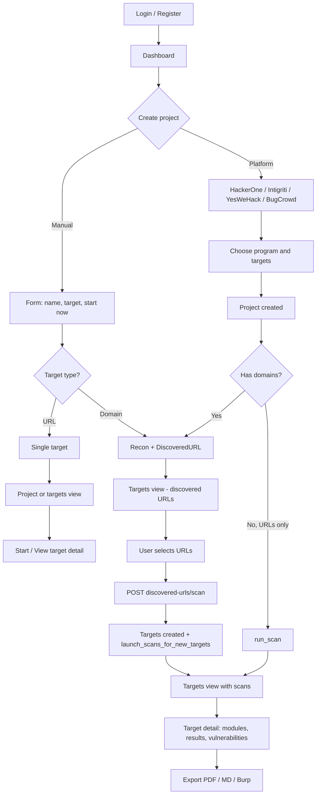
```mermaid
flowchart TB
    A[Login / Register] --> B[Dashboard]
    B --> C{Create project}
    C -->|Manual| D[Form: name, target, start now]
    C -->|Platform| E[HackerOne / Intigriti / YesWeHack / BugCrowd]
    E --> F[Choose program and targets]
    F --> G[Project created]
    D --> H{Target type?}
    H -->|URL| I[Single target]
    H -->|Domain| J[Recon + DiscoveredURL]
    I --> K[Project or targets view]
    J --> L[Targets view - discovered URLs]
    G --> M{Has domains?}
    M -->|Yes| J
    M -->|No, URLs only| N[run_scan]
    L --> O[User selects URLs]
    O --> P[POST discovered-urls/scan]
    P --> Q[Targets created + launch_scans_for_new_targets]
    Q --> R[Targets view with scans]
    N --> R
    K --> S[Start / View target detail]
    R --> T[Target detail: modules, results, vulnerabilities]
    T --> U[Export PDF / MD / Burp]
```

### Recon → Discovered URLs → Selection → Scan

```mermaid
flowchart LR
    subgraph Input
        A[Domain(s)]
    end
    subgraph Recon
        B[Subfinder]
        C[Httpx]
        D[Active URLs]
    end
    subgraph DB
        E[DiscoveredURL]
        F[ScanState: awaiting_url_selection]
    end
    subgraph UI
        G[Targets view: URL checkboxes]
        H[POST discovered-urls/scan]
    end
    subgraph Scan
        I[Target per URL]
        J[launch_scans_for_new_targets]
        K[run_scan_target per target]
    end
    A --> B --> C --> D --> E --> F
    F --> G --> H --> I --> J --> K
```

### Scan worker flow (per target)

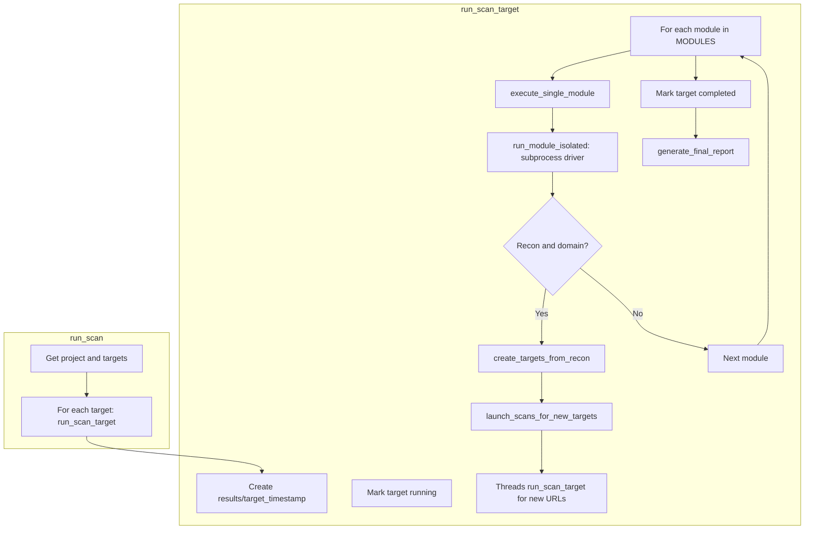
```mermaid
flowchart TB
    subgraph run_scan
        A[Get project and targets]
        A --> B[For each target: run_scan_target]
    end
    subgraph run_scan_target
        C[Create results/target_timestamp]
        D[Mark target running]
        E[For each module in MODULES]
        E --> F[execute_single_module]
        F --> G[run_module_isolated: subprocess driver]
        G --> H{Recon and domain?}
        H -->|Yes| I[create_targets_from_recon]
        I --> J[launch_scans_for_new_targets]
        J --> K[Threads run_scan_target for new URLs]
        H -->|No| L[Next module]
        L --> E
        E --> M[Mark target completed]
        M --> N[generate_final_report]
    end
    B --> C
```

### Module order (pipeline)

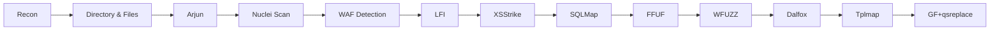
```mermaid
flowchart LR
    M1[Recon] --> M2[Directory & Files] --> M3[Arjun] --> M4[Nuclei Scan] --> M5[WAF Detection] --> M6[LFI] --> M7[XSStrike] --> M8[SQLMap] --> M9[FFUF] --> M10[WFUZZ] --> M11[Dalfox] --> M12[Tplmap] --> M13[GF+qsreplace]
```

---

## Installation and configuration

### Requirements

- **Docker** 20.10+ and **Docker Compose** v2 (recommended), or
- **Python 3.11+** with dependencies from `requirements.txt` and security tools installed (Subfinder, Httpx, Nuclei, GAU, Waybackurls, Katana, Dalfox, FFUF, SQLMap, XSStrike, Tplmap, Arjun, etc.).
- **Memory**: Minimum 4 GB RAM (8 GB recommended for parallel scans).
- **Disk**: ~20 GB free for results and Nuclei templates.

### Quick install (Docker)

```bash
git clone https://github.com/pereznacho/Bounty_Hunter.git
cd Bounty_Hunter
docker-compose up --build
```

- Access: **http://localhost:8000**
- Database and `results/` directory persist on the mounted volume (`.` → `/app`).

### Docker Hub

Pull the pre-built image:

```bash
docker pull nachin519/bounty_hunter
```

Then start the container (see `docker-compose.yml` for volume mounts and full setup).

---

### Initial setup (after first run)

1. Register a user at `/register`.
2. Log in at `/login`.
3. Create a manual project via “New project” or import from Programs (HackerOne, Intigriti, YesWeHack, BugCrowd).

### Environment variables

| Variable | Description | Default |
|----------|-------------|---------|
| `SQLALCHEMY_DATABASE_URL` | Database URL (SQLite/other) | `sqlite:///./db.sqlite3` |
| `GITHUB_REPO` | Repo for version check | `pereznacho/Bounty_Hunter` |

Docker Compose uses `SQLALCHEMY_DATABASE_URL=sqlite:////app/db.sqlite3` so data persists on the volume.

---

## Project structure

```
Bounty_Hunter/
├── backend/
│   ├── main.py              # FastAPI app, main routes, dashboard, project CRUD
│   ├── auth.py              # Login, register, theme, get_current_user
│   ├── models.py            # User, Project, Target, ScanState, DiscoveredURL, etc.
│   ├── constants.py         # MODULES, MODULE_ALIASES, themes, vuln files, severity
│   ├── database.py          # get_db
│   ├── init_db.py           # Table creation
│   ├── scan_worker.py       # run_scan, run_scan_target, execute_single_module, recon auto-expand
│   ├── project_routes.py    # POST /projects, start, skip, export PDF/MD/Burp, status APIs
│   ├── template_filters.py  # Jinja2 filters
│   └── routers/
│       ├── project.py       # Delete project, vulnerability-status API
│       ├── hackerone.py     # Program list, import, scan (recon + run_scan)
│       ├── intigriti.py
│       ├── yeswehack.py
│       └── bugcrowd.py
├── modules/
│   ├── recon.py            # Recon domain/URL, run_domain_recon_save_for_selection
│   ├── dir_discovery.py
│   ├── arjun.py
│   ├── nuclei_scan.py
│   ├── waf.py
│   ├── lfi.py
│   ├── xss.py
│   ├── sqli.py
│   ├── ffuf.py
│   ├── wfuzz_fuzz.py
│   ├── dalfox_scan.py
│   ├── tplmap.py
│   └── gf_qsreplace.py
├── utils/
│   ├── path_utils.py
│   ├── helpers.py
│   ├── realtime_results.py
│   ├── reporter.py
│   └── burp_exporter.py
├── templates/               # Jinja2: login, register, dashboard, project_detail, project_targets, etc.
├── static/
│   ├── themes.css          # Themes: default, cyberpunk, neon, matrix, tron, purple, military, hackthebox
│   └── style.css
├── results/                 # Per-target dirs: <safe_name>_<timestamp>
├── requirements.txt
├── Dockerfile               # Python 3.11, Go, Subfinder, Httpx, Nuclei, Dalfox, SQLMap, XSStrike, etc.
└── docker-compose.yml
```

---

## Scan modules

Order and names as in `backend/constants.MODULES`:

| # | Module | Brief description |
|---|--------|--------------------|
| 1 | Recon | Subfinder + Assetfinder, Httpx (live), GAU/Waybackurls/Katana; produces subdomains, live URLs, urls.txt, urls_with_params.txt; in domain mode creates targets from live and launches scans. |
| 2 | Directory & Files | Directory/file discovery (dirsearch/gobuster or similar). |
| 3 | Arjun | GET/POST parameter discovery. |
| 4 | Nuclei Scan | Scanning with Nuclei templates (CVE, misconfigs, exposures). |
| 5 | WAF Detection | WAF detection (wafw00f). |
| 6 | LFI | Local File Inclusion checks. |
| 7 | XSStrike (XSS) | XSS detection. |
| 8 | SQLMap (SQLi) | Automated SQL injection. |
| 9 | FFUF | Path/parameter fuzzing. |
| 10 | WFUZZ | Web fuzzing. |
| 11 | Dalfox | XSS scanner with bypasses. |
| 12 | Tplmap | Template injection (SSTI). |
| 13 | GF + qsreplace | GF patterns and parameter replacement for payloads. |

UI aliases (mapping in `MODULE_ALIASES`): SQL Injection Testing → SQLMap (SQLi), Template Injection Testing → Tplmap, Directory Discovery → FFUF, Parameter Discovery → GF + qsreplace, XSS Testing → XSStrike (XSS), Port Scanning → Nuclei Scan, Web Crawling → Arjun.

---

## Vulnerability severity system

- **Detection**: Files such as `dalfox_results.txt`, `xss_vulnerables.txt`, `sql_vulnerables.txt`, `tplmap_results.txt`, `ffuf_results.txt`, `wfuzz_results.txt`, `arjun_results.txt`, `sqlmap_results.txt`, `xsstrike_results.txt` in the project or target directory are checked. “No findings” phrases and a minimum content size are excluded.
- **Levels**: **Critical**, **High**, **Medium**, **Low** (priority order). Keywords per level in `backend/constants.SEVERITY_KEYWORDS`.
- **Dashboard colors**: Critical (purple), High (red), Medium (orange), Low (green).

### Severity by tool and vulnerability type

The dashboard assigns the highest severity found in result files. The following table and diagram summarize how **tools** and **vulnerability types** map to **Critical**, **High**, **Medium**, and **Low**:

| Severity | Tools / sources | Vulnerability types / keywords |
|----------|----------------|---------------------------------|
| **Critical** | Nuclei, SQLMap | RCE, SQL injection (SQLi), auth bypass, severe / high-risk findings |
| **High** | Nuclei, Dalfox, XSStrike, Tplmap, LFI modules | XSS (stored/reflected), CSRF, LFI, RFI, cross-site scripting, template injection (SSTI), dangerous |
| **Medium** | Nuclei, FFUF, WFUZZ, LFI | Medium, warning, potential, directory traversal, LFI |
| **Low** | Nuclei, Arjun, FFUF, WFUZZ | Low, info, information disclosure, fingerprinting, misconfiguration |

### Severity levels diagram


```mermaid
flowchart LR
    subgraph Critical
        C1[RCE / SQLi / Auth Bypass]
        C2[Nuclei critical]
        C3[SQLMap critical]
    end
    subgraph High
        H1[XSS / CSRF / LFI / RFI]
        H2[Template injection]
        H3[Dalfox / XSStrike / Tplmap]
    end
    subgraph Medium
        M1[Directory traversal]
        M2[FFUF / WFUZZ findings]
        M3[Nuclei medium]
    end
    subgraph Low
        L1[Info disclosure]
        L2[Arjun params / misconfig]
        L3[Nuclei low]
    end
    Critical --> High --> Medium --> Low
```

---

## Routes and API

### Auth

| Method | Path | Description |
|--------|------|-------------|
| GET | `/login` | Login form |
| POST | `/login` | Login (session) |
| GET | `/register` | Registration form |
| POST | `/register` | Register |
| POST | `/auth/login` | JSON API login |
| POST | `/auth/register` | JSON API register |
| GET | `/logout` | Logout |

### Main

| Method | Path | Description |
|--------|------|-------------|
| GET | `/` | Redirects to `/login` |
| GET | `/dashboard` | Dashboard (user’s projects) |
| GET | `/api/user/theme` | User theme |
| POST | `/api/user/theme` | Save theme |
| GET | `/api/version` | App version |
| GET | `/api/version/check` | Latest version on GitHub |

### Projects (main)

| Method | Path | Description |
|--------|------|-------------|
| GET | `/project/new` | New manual project form |
| POST | `/project/new` | Create manual project (recon if domain + start) |
| GET | `/project/{id}` | Project detail (manual) |
| GET | `/project/{id}/targets` | Targets list and discovered URLs |
| GET | `/project/{id}/target/{tid}` | Target detail |
| POST | `/project/{id}/start` | Start scan (legacy) |
| POST | `/project/{id}/stop` | Stop legacy process |
| POST | `/project/{id}/stop-scan` | Stop all project scans |
| POST | `/project/{id}/target/{tid}/stop` | Stop one target’s scan |
| POST | `/project/{id}/discovered-urls/scan` | Create targets from selected URLs and launch scans |
| POST | `/project/{id}/target/{tid}/delete` | Delete target and results |
| POST | `/project/{id}/delete` | Delete project |
| GET | `/project/{id}/results` | Results (JSON) |
| GET | `/api/project/{id}/status` | Scan status |
| GET | `/api/project/{id}/discovered-urls` | Discovered URLs (count, list, awaiting_selection) |
| GET | `/go_to_project/{id}` | Redirect to detail or targets by project type |

### Projects (project_routes)

| Method | Path | Description |
|--------|------|-------------|
| POST | `/projects` | Create project (legacy, always run_scan) |
| POST | `/project/{id}/start` | Start run_scan in thread |
| POST | `/project/{id}/skip` | Skip current module (per target) |
| POST | `/project/{id}/repeat` | Repeat scan |
| POST | `/project/{id}/stop` | Stop scan |
| POST | `/project/{id}/delete` | Delete project |
| GET | `/api/project/list` | List projects |
| GET | `/api/project/{id}/status` | Status |
| GET | `/project/{id}/export` | Export PDF |
| GET | `/project/{id}/download-md` | Download Markdown |
| GET | `/project/{id}/export/burp` | Export Burp |
| POST | `/target/{tid}/mark-vulnerability-viewed` | Mark alert viewed |
| POST | `/api/target/{tid}/mark-viewed` | Mark vulnerabilities viewed |
| POST | `/api/project/{id}/mark-all-viewed` | Mark all viewed |
| GET | `/api/project/{id}/vulnerability-status` | Vulnerability status |
| GET | `/api/project/{id}/vulnerabilities-live` | Live vulnerability feed |

### Platforms

- **HackerOne**: `/hackerone`, `/hackerone/import`, `/hackerone/program/{handle}`, POST `/hackerone/scan`, POST `/scan`, etc.
- **Intigriti**: `/` (router), `/program/{handle}`, POST `/scan`.
- **YesWeHack**: `/` (router), `/program/{handle}`, POST `/scan`.
- **BugCrowd**: `/` (router), `/program/{handle}`, POST `/scan`.

---

## Themes and export

- **Available themes** (`VALID_THEMES`): `default`, `cyberpunk`, `neon`, `matrix`, `tron`, `purple`, `military`, `hackthebox`, `parrot`. Stored per user in DB and in a cookie for public pages.
- **Export**:
  - **PDF**: WeasyPrint from template `export_pdf.html`; includes files from the project results directory.
  - **Markdown**: Generated with `utils.reporter.generate_markdown_report`; download as `Proyecto.md`.
  - **Burp**: `utils.burp_exporter.export_to_burp_txt` produces a text file with URLs/parameters to import into Burp Suite.

### Theme previews

| Theme | Screenshot |
|-------|------------|
| **Default** | 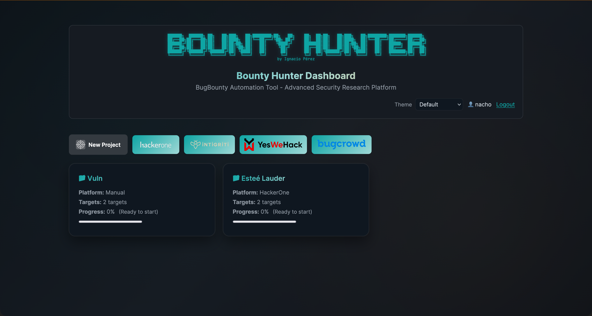 |
| **Cyberpunk** | 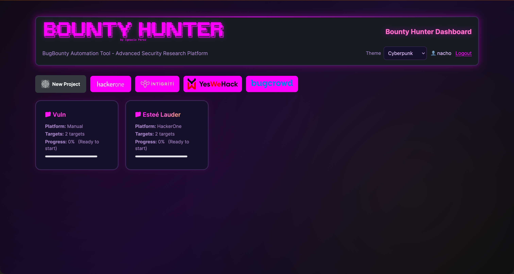 |
| **HackTheBox** | 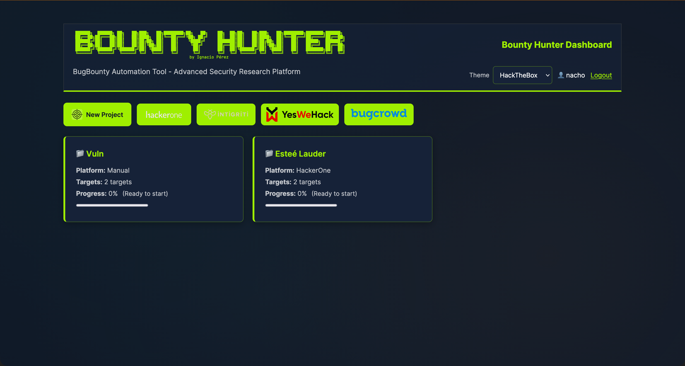 |
| **Matrix** | 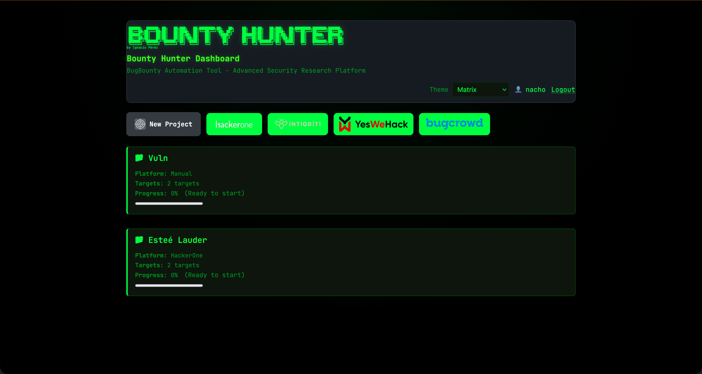 |
| **Military** | 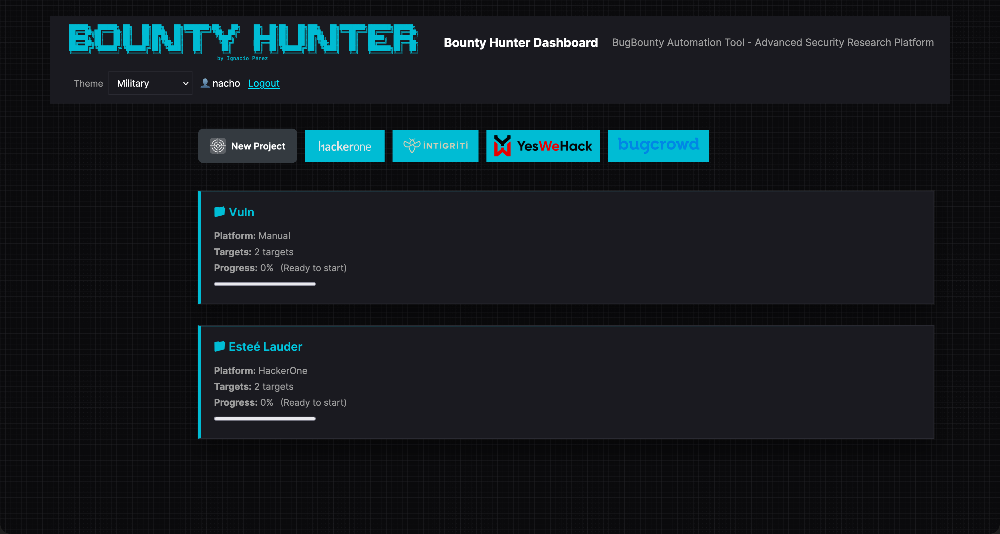 |
| **Neon** | 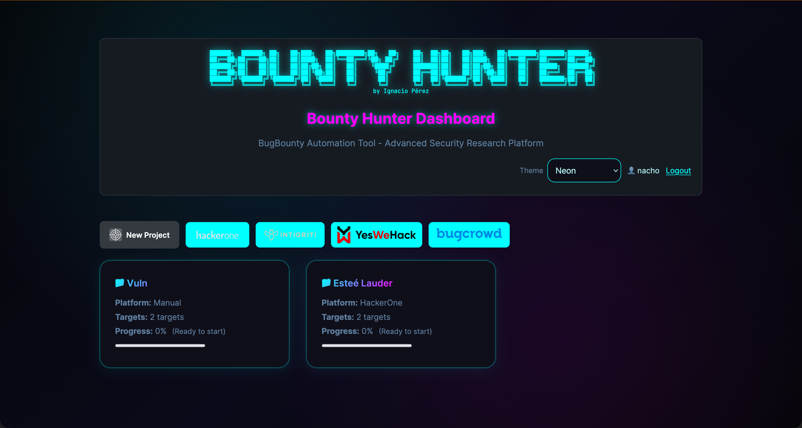 |
| **Parrot** | 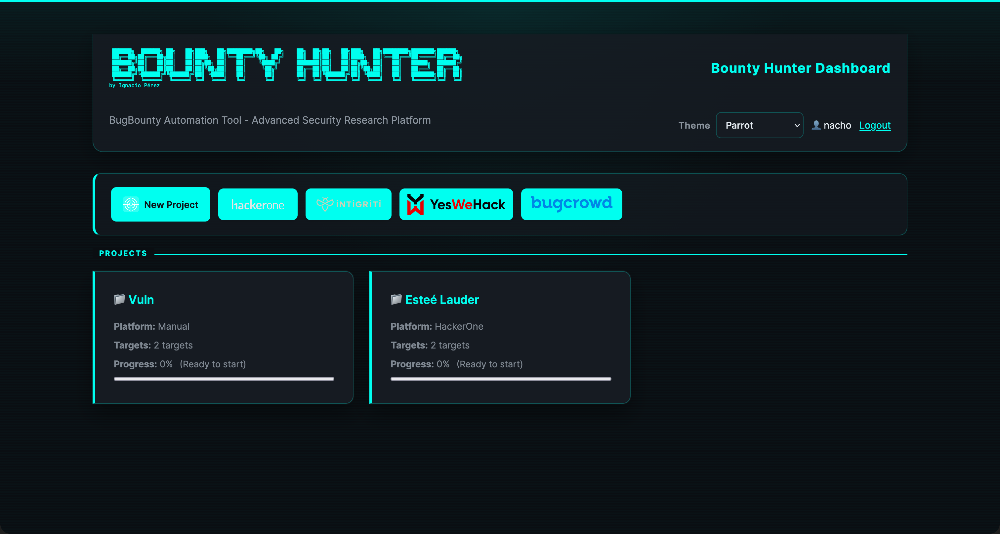 |
| **Purple** | 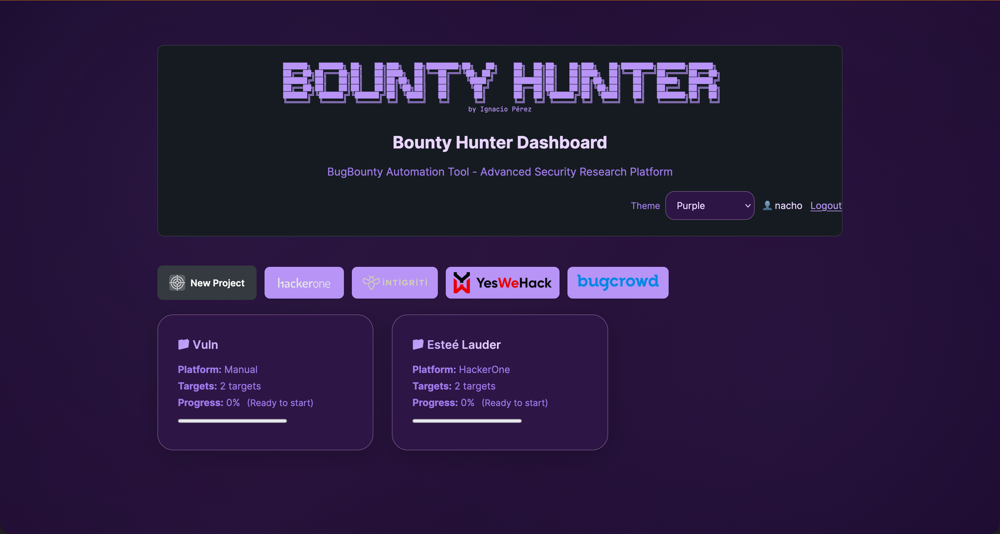 |
| **Tron** | 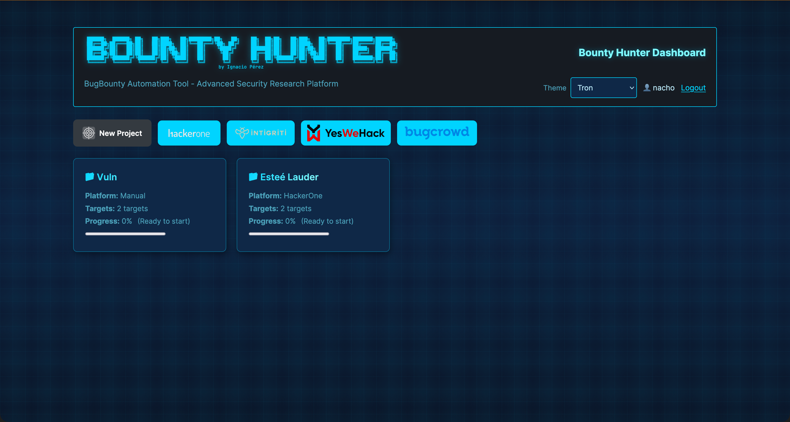 |

---

## Contributing and contact

- **Bugs**: Use GitHub Issues with reproduction steps and logs.
- **New features**: Fork, branch `feature/name`, Pull Request with a clear description.
- **Contact**:
  - Web: https://iperez.com.ar  
  - Email: nacho@iperez.com.ar  
  - Twitter: @nachoct  
  - LinkedIn: /in/ignacio-perez  

---

## Changelog and license

### Recent changelog

- **v2.0.1**: Auto-expanded mode (bounty programs = manual flow), dashboard with logos and real-time alerts, unified backend, severity colors aligned with standards.
- **v2.0.0**: Multi-platform support (HackerOne, Intigriti, YesWeHack, BugCrowd), real-time monitoring, modern UI and dark theme.

### License

MIT. See [LICENSE](LICENSE).

---

**Bounty_Hunter — Automating security, one scan at a time.**
